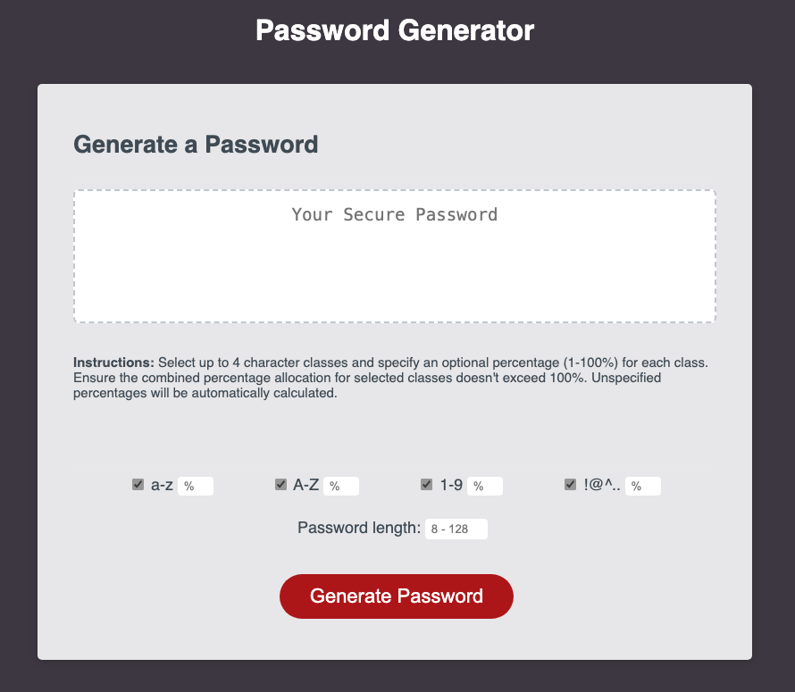

# Dynamic Password Generator

Welcome to the "Dynamic Password Generator" project repository. This web application is designed to generate random passwords based on user-specified options, offering a dynamic and user-friendly approach to password creation. This readme provides an in-depth overview of the project, its motivations, implementation details, challenges addressed, insights gained, and usage instructions.

[app-screenshot-1](./assets/images/app-screenshot-1.png)
[app-screenshot-1](./assets/images/app-screenshot-2.png)

## Usage

To explore the "Dynamic Password Generator," follow these steps:

1. Visit the deployed application at [Dynamic Password Generator](https://jimmygian.github.io/edX_my-code-generator/).

2. Within the web application, you can select up to four character classes and specify optional percentages (1-100%) for each class.

3. Unspecified percentages will be automatically calculated to ensure that the total percentages add up to 100%.  
*Ensure that the combined percentage allocation for selected classes does not exceed 100%, or that you have left enough room for unspecified classes to be automatically allocated.*

4. Set the desired password length within the range of 8 to 128 characters.

5. Click the "Generate Password" button to generate a secure password based on your preferences.

You can generate as many passwords as you want, but please note that previous passwords are not stored and will be lost after re-generating random password.

## Motivations

The "Dynamic Password Generator" project was driven by the following motivations:

1. **JavaScript Techniques:** The primary goal was to leverage JavaScript's core concepts, including object manipulation, array iteration, complex loops, and conditional statements, to create a robust and dynamic password generator that can be user-adjusted.

2. **Algorithmic Thinking:** The project aimed to develop an efficient algorithm to generate passwords based on user preferences. This required algorithmic thinking, problem-solving, and logic design.

## Implementation Details

### JavaScript Object Manipulation

The project makes extensive use of JavaScript objects to manage user options and password generation logic. Key functionalities include:

- **User Preferences:** Users can select up to four character classes (lowercase, uppercase, numeric, special characters) and specify optional percentages (1-100%) for each class. Each percentage represents the chances the class has to be selected when the password is generated.
- **Percentage Calculation:** The application ensures that the combined percentage allocation for selected classes always sums to 100%. If the user did not specify 1 or more percentges for the selected classes, it automatically calculates unspecified percentages to maintain a total of 100%. Additionally, it checks for every possible input and prompts different error messages depending on the occasion, to help guide the user.
- **Password Length:** Users can set the desired password length within the range of 8 to 128 characters.

### Event Listeners

Event listeners were implemented to capture user interactions and trigger the password generation process. The "Generate Password" button initiates the generation of a secure password based on the user's preferences.

### Responsive Design with Custom CSS

The project incorporates custom CSS to ensure a visually appealing and responsive web application. The design adapts to various screen sizes using media queries, creating a user-friendly experience for all device types.

## Challenges Addressed

The "Dynamic Password Generator" project addressed the following challenges:

1. **Dynamism:** It provides a dynamic solution to password generation, allowing users to specify character classes and percentages, offering a highly customized approach to creating secure passwords.

2. **Algorithm Design:** The project required creating a complex algorithm to generate passwords while adhering to user preferences. Ensuring that the password includes all specified character classes was a significant challenge.

## Insights Gained

The development of the "Dynamic Password Generator" project provided valuable insights:

- **User Interaction:** Understanding the importance of user interaction and creating user-friendly interfaces is crucial in web development.
- **JavaScript Proficiency:** The project enhanced proficiency in JavaScript, particularly in managing objects, arrays, methods (such as .forEach, .includes), Event listeners, and using conditional statements effectively.
- **Algorithmic Skills:** Developing the password generation algorithm improved problem-solving skills and the ability to design efficient algorithms.
- **Responsive Web Design:** Creating a responsive design using custom CSS reinforced the principles of responsive web development.

## Credits

This project was conceived, developed, and is actively maintained by Dimitris Giannoulis. Special thanks to the online coding bootcamp for providing the foundational knowledge and support to complete this project.

## License

This project is licensed under the MIT License, granting you the freedom to use and modify the code in accordance with the terms specified in the [MIT License](https://opensource.org/licenses/MIT).

## Links

